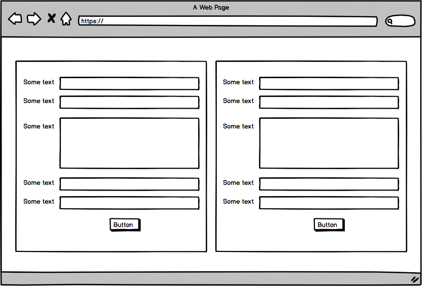

http://blockchain-voting-system.surge.sh/

# Blockchain voting app.

	•	In this project I’m exploring blockchain basics and how it can be made tamper-proof through use of blockchain technology.

	•	The 3 main files of this small project are:
	•	> blockchanManager.js - describe the functions
	•	> blockchain.js aka index.js - describe the functions
	•	> index.html - describe the functions

	•	The technologies are:
	•	> webpack.config.js
	•	> Handlebars.js
	•	> Crypto-JS library provides the SHA256.js module
	•	> Jasmine Testing library

	•	Testing:
	•	to run the test: [ jasmine spec/spec-test.js ]
	•	the test file is: spec/spec-test.js

	•	The Readme.md file contains:
	•	screenshot of a block form
	•	future features
	•	instructions for installation and operation
	•	technologies used
	•	link to Pivotal Tracker

	•	Things to demonstrate:
	•	run the test and play with it a bit
	•	show the raw block data in console & in code
	•	show the blocks being mined - via hash & nonce

	•	The Design Phase:
	•	describe basic interactivity - simple voting
	•	OAuth 2.0 login
	•	more ideas

	•	Deployment:
	•	use Surge.sh to deploy the application
